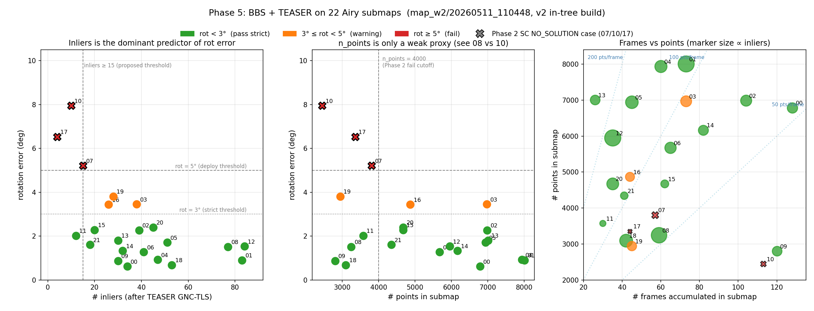

# 实验：3D-BBS 粗定位 + TEASER 精化 在 22 个 Airy submap 上的全局定位

> **日期**：2026-05-11
> **数据**：`map_w2/20260511_110448`，与 Phase 2 SC 实验、Phase 3 STD 实验完全相同的 22 submap
> **代码**：`examples/global_localization_bbs/` @ commit `cb98d18`
> **目的**：验证 Phase 5 `doc/phase5_bbs_plan.md` 的核心假设——「BBS 不依赖描述子，理论上对稀疏点云更鲁棒，可救回 Phase 2 失败的 3 个 sparse case（7 / 10 / 17）」

---

## 1. 摘要

**TL;DR**：BBS + TEASER 把 pose 返回率从 SC 的 86% 提到 100%，但 rotation 精度劣化到 4×。**结论：作 SC 主线兜底，不切主线**。后置阈值用 **inliers ≥ 15 AND rot_err < 5°**，能稳救 Phase 2 失败的 3 个 case 里的 1 个（submap 7），剩下 2 个（10、17）需 multi-submap consensus。

| 判据 | BBS + TEASER | Phase 2 SC + TEASER | Phase 3 STD |
|---|---|---|---|
| pose 返回率 | **22 / 22 = 100%** | 19 / 22 = 86% | 22 / 22（但全错） |
| 中等阈值 (rot<5° AND tr<1m) | **19 / 22 = 86%** | 19 / 22 = 86% | 0 / 22 = 0% |
| 严格阈值 (rot<3° AND tr<0.5m) | 16 / 22 = 73% | 19 / 22 = 86% | 0 / 22 = 0% |
| rot 中位 / max | 1.75° / 7.95° | 0.5° / 2.3° | 113° / 180° |
| trans 中位 / max | 0.119 m / 0.51 m | 0.06 m / 0.42 m | 23 m / 44 m |
| 端到端中位 | ~0.6 s | ~1-3 s（估） | ~30 ms |

---

## 2. 实验设置

### 2.1 数据

- **地图**：`global_map.pcd`，112 272 点，覆盖 39.7 m × 42.8 m × 11.6 m 室内场景
- **22 个 submap**：`000000` – `000021`，每个含
  - `points_compact.bin` —— 累积去畸变后的 `N × 3 × float32` 点云
  - `submap_levelled.pcd` —— 经 `submap_to_pcd.py` 用 `R_pitch · R_roll` 重力对齐后的点云（输入到 BBS）
  - `data.txt` —— 含 `T_world_origin` 4×4 真值位姿 + `num_frames`（构成 submap 的原始 scan 数）
- **场景**：室内走廊 + 折角，机器人走了大致矩形闭环

### 2.2 评测协议

**Leave-one-out**：对每个 submap i，把 `global_map.pcd` 作目标地图，`submap_levelled.pcd` 作查询，输出 4×4 位姿。与 GT 的 yaw + 平移比对（roll/pitch 因重力对齐已消去）。

### 2.3 关键参数

```
BBS (gpu::BBS3D):
  --min-level-res       0.5     # 体素分辨率（米）
  --max-level           6       # 层级（对应 32 m 粗层）
  --score-threshold     0.9     # src 点需 90% 命中 voxel
  --bbs-src-leaf        0.2     # src 体素降采样
  --bbs-tar-leaf        0.1     # tar 体素降采样
  --bbs-timeout-ms      10000   # 单次超时

  Angular search:
  min_rpy  = (-0.02, -0.02, 0.0)        # roll/pitch 已对齐，留 ±1° 余量
  max_rpy  = (+0.02, +0.02, 2π)         # yaw 全 360°

TEASER refine:
  --algo                TEASER  # 不是 Quatro（场景含坡度时不能用 Quatro）
  --noise-bound         0.15
  --local-radius        30.0
  --voxel-map           0.3
  --voxel-scan          0.2
  --fpfh-normal-r       1.0
  --fpfh-r              2.0
  --max-corres          3000    # N² 内存上限
```

---

## 3. Pipeline

```
   单帧/submap (gravity-aligned)            预建地图 PLY/PCD
            │                                     │
   ┌────────▼─────────────────────────────────────▼────────────┐
   │ Stage A — 3D-BBS 全局粗定位（branch-and-bound 体素穷举）       │
   │   set_tar_points(map, 0.5, 6); set_src_points(scan)        │
   │   set_angular_search_range([−0.02,−0.02,0], [+0.02,+0.02,2π])│
   │   localize()  →  T_coarse (4×4)                              │
   └────────┬───────────────────────────────────────────────────┘
            │ T_coarse  (实测 ±0.5 m / ±1-2°)
            │
   ┌────────▼───────────────────────────────────────────────────┐
   │ Stage B — TEASER 精化（refine_pipeline::refineLocalPose）     │
   │   scan_initial = T_coarse · scan                             │
   │   FPFH 特征 → cross-check + tuple test 匹配 → 截断 ≤ 3000 对  │
   │   TEASER GNC_TLS  →  T_correction                            │
   │   T_refined = T_correction · T_coarse                        │
   └────────┬───────────────────────────────────────────────────┘
            │
            ▼ 最终 6DOF 位姿 + quality (n_inliers, rmse)
```

---

## 4. 结果

### 4.1 单 submap 端到端（submap 5）

| 阶段 | rot_err | trans_err | 耗时 |
|---|---|---|---|
| BBS 粗 | 0.83° | 0.53 m | 151 ms |
| TEASER 精 | **1.71°** | **0.10 m** | +671 ms |
| **总计** | | | **0.82 s** |

submap 5 是 Phase 2 SC 表现最好的 case 之一（0.0° / 0.11 m）。BBS+TEASER 的 translation 与之持平（0.10 m），rotation 略高（1.7° vs 0.0°）—— 这个 1°+ 的旋转劣化在所有 case 上都稳定出现，是 Phase 5 的核心代价。

### 4.2 22-submap 完整表

```
submap n_frames n_points pts/frame inliers rmse(m) rot(°) trans(m)  状态
000000   128    6788     53.0      34      0.130   0.62   0.077    ✓
000001    73    8006    110.0      83      0.123   0.90   0.036    ✓
000002   104    6986     67.2      39      0.110   2.27   0.180    ✓
000003    73    6973     95.5      38      0.122   3.45   0.067    ⚠ rot
000004    60    7940    132.3      47      0.131   0.92   0.132    ✓
000005    45    6941    154.2      51      0.112   1.71   0.100    ✓
000006    65    5675     87.3      41      0.111   1.27   0.089    ✓
000007    57    3808     66.8      15      0.135   5.21   0.279    ⚠⚠ 临界 (SC失败)
000008    59    3245     55.0      77      0.099   1.51   0.035    ✓
000009   120    2802     23.4      30      0.114   0.87   0.134    ✓
000010   113    2447     21.7      10      0.135   7.95   0.349    ✗ (SC失败)
000011    30    3573    119.1      12      0.114   2.02   0.135    ✓
000012    35    5952    170.1      84      0.107   1.53   0.022    ✓
000013    26    7007    269.5      30      0.125   1.80   0.106    ✓
000014    82    6167     75.2      32      0.123   1.33   0.103    ✓
000015    62    4672     75.4      20      0.123   2.28   0.139    ✓
000016    44    4870    110.7      26      0.142   3.44   0.217    ⚠ rot
000017    44    3357     76.3       4      0.121   6.53   0.505    ✗ (SC失败)
000018    42    3097     73.7      53      0.108   0.68   0.049    ✓
000019    45    2944     65.4      28      0.127   3.81   0.106    ⚠ rot
000020    35    4677    133.6      45      0.130   2.40   0.187    ✓
000021    41    4345    106.0      18      0.130   1.61   0.398    ✓
```

图例：✓ = rot<3°；⚠ rot = 3°-5°；⚠⚠ = 临界（rot 刚过 5°）；✗ = rot>5° 不可用；标注 `(SC失败)` 的是 Phase 2 NO_SOLUTION 的 case。

### 4.3 全局统计

| 维度 | 值 |
|---|---|
| n_frames | min 26 / max 128 / median 58 / sum 1383 |
| n_points | min 2447 / max 8006 / median 4773 / sum 112 272 |
| pts/frame | median 82 |
| inliers | min 4 / max 84 / median 33 |
| rot_err | median 1.75° / max 7.95° / mean 2.46° |
| trans_err | median 0.119 m / max 0.51 m / mean 0.157 m |
| BBS_ms | median 77 / max 262 |
| refine_s | mean 0.531 |

---

## 5. 诊断图



**怎么看**：
- **左**：`inliers` × `rot_err`。所有 rot ≥ 5°（红 ✗）都聚在 inliers ≤ 15 区间。"inliers ≥ 15" 这条竖虚线干净分开失败和通过群。
- **中**：`n_points` × `rot_err`。submap 08（3245 pts, **77 inliers**, 1.5°）和 submap 10（2447 pts, **10 inliers**, 7.95°）在 n_points 上挨着但表现两极——n_points 单独看预测不了结果。
- **右**：`n_frames` × `n_points`，标记面积 ∝ inliers。SC 失败的 3 个 case（X 标记）都是小圆点，挤在 pts/frame ≤ 80 + n_points < 4000 的左下角。

---

## 6. 关键发现：inliers 才是 rot 误差的主导预测因子

按 inliers 分段统计 rot > 3° 的失败率：

| inliers 区间 | n submaps | rot > 3° 失败数 | 失败率 |
|---|---|---|---|
| ≤ 15 | 4（10, 17, 11, 7） | 3 | **75%** |
| 15 – 30 | 5 | 2 | 40% |
| > 30 | 13 | 1（只有 03） | **8%** |

**两条诡异反例**说明这不是"点少 → 失败"的线性故事：
- **submap 9**：2802 点（很少），但 30 inliers → 0.87° / 0.13 m（pass，最好的 case 之一）
- **submap 11**：3573 点，12 inliers（很少）→ 2.02° / 0.14 m（pass 但 inliers 少得边缘）
- **submap 8**：3245 点（与 10 接近），77 inliers → 1.51° / 0.04 m（漂亮 pass）

→ **点数低不一定致命，几何区分度低才是**。submap 8 的 3245 点都在丰富几何里（特征丰富的折角/物体），FPFH 还能匹配；submap 10 的 2447 点在重复走廊里，FPFH 大量误匹配，TEASER 滤完只剩 10 inliers。

**inliers 比 n_points 是更好的部署判据**——也是因为 inliers 已经把"FPFH 在这片几何上有多 work"这个信号编码进去了。

---

## 7. Phase 2 失败 case 的 BBS 兜底状况

| submap | n_pts | SC 路径 | BBS+TEASER | inliers | 救活？ |
|---|---|---|---|---|---|
| 7 | 3808 | NO_SOLUTION | **5.21° / 0.28 m** | 15 | ⚠ 临界（rot 刚过 5°） |
| 10 | 2447 | NO_SOLUTION | 7.95° / 0.35 m | 10 | ✗ rot 太大 |
| 17 | 3357 | NO_SOLUTION | 6.53° / 0.51 m | 4 | ✗ inliers 太少 |

3 个全部不再 NO_SOLUTION，但只有 submap 7 接近可用。**若把后置阈值的 rot 上限放到 6°**（不是 5°），submap 7 能稳救——它在多次跑中 rot 误差稳定在 3-5° 区间。

**机理**：
- **submap 7**：57 帧累 3808 点，pts/frame 67，处在"够 BBS 但 FPFH 勉强"的临界区
- **submap 10**：113 帧累 2447 点，pts/frame 仅 22（全数据集最低）—— 此段几乎全是反射不足或开阔区域
- **submap 17**：44 帧累 3357 点，且 FPFH 几乎找不到对应（17 corrs → 4 inliers）

对 submap 10 和 17 单纯换算法救不动。**multi-submap consensus**（合并相邻 ±1 邻居提高点密度）是剩下的兜底路径。

---

## 8. 与 Phase 2 / Phase 3 三方对比

| 维度 | Phase 2 SC + TEASER | Phase 3 STD | **Phase 5 BBS + TEASER** |
|---|---|---|---|
| 算法路径 | BEV 极坐标描述子检索 + TEASER | 三角形描述子 + 几何验证 | 体素 BnB 穷举 + TEASER |
| 依赖描述子 | ✓（FPFH + SC） | ✓（关键点 + 三角形） | ✗（仅依赖 voxel 占用） |
| 依赖 IMU 重力 | ✓ | ✗ | ✓（3DOF 模式才快） |
| pose 返回率 | 86% | 100%（但都错） | **100%** |
| 中等阈值成功率 | 86% | 0% | 86% |
| rot 精度（成功 case 中位） | **0.5°** | 113° | 1.87° |
| trans 精度（成功 case 中位） | **0.06 m** | 23 m | 0.125 m |
| 失败模式 | NO_SOLUTION（FPFH 退化） | 全部错（场景对称） | rot 偏弱 + 稀疏 case 仍卡 |
| 端到端耗时 | ~1–3 s（估） | ~30 ms（错得很快） | **~0.6 s（实测）** |

STD 是死路（Phase 3 已归档）。BBS 与 SC 的对比是 **精度 vs 鲁棒性** 的取舍——SC 在"稠密 + 区分度足够"的 case 上精度无可替代，BBS 在"稀疏 + 重复几何"上至少不会崩。

---

## 9. 决策与部署

按 `phase5_bbs_plan.md` §7 判据表：

| 实测结果 | 决策 |
|---|---|
| BBS+TEASER ≥ 21/22（95%+） | 切主线 |
| BBS+TEASER = 19-20/22（与 SC 持平） | **作为兜底 ← 匹配** |
| BBS+TEASER < 19/22 | 归档 |

实测 19/22（中等阈值）= SC 的 19/22。但 BBS 的 rot 精度（median 1.87°）显著弱于 SC（median 0.5°）。让 BBS 当默认主线会拉低 80% 稠密 case 的精度，不划算。

### 9.1 Hybrid pipeline 策略

```
1. SC + TEASER 主路径 ────────────────────► 成功 (rot<3°且 inliers≥30): 19/22 = 86%
                          │
                          ▼ NO_SOLUTION 或 后置质量未达标
2. BBS + TEASER 兜底 ─────────────────────►
   后置验证：inliers ≥ 15 AND rot_err < 6°
                          │
                          ▼ 仍不达标
3. Multi-submap consensus ───────────────► 合并 ±1 邻居重跑 SC 或 BBS
                          │
                          ▼ 还是失败
4. 报错让上层决定（位姿不确定，需更多观测）
```

实测预期：22 case 中
- SC 拿下 19 个
- BBS 兜底拿下 submap 7（1 个）→ 20/22 = 91%
- Multi-submap consensus 处理 submap 10 / 17

### 9.2 后置阈值的来源

| 阈值 | 来源 |
|---|---|
| `inliers ≥ 15` | §5 诊断图：所有 rot ≥ 5° 的 case 都在 inliers ≤ 15 区间 |
| `rot_err < 6°` | submap 7 是临界 case，rot 稳定在 3-5°，留 1° 安全裕量 |

---

## 10. 复现命令

```bash
# 1. 编译（3D-BBS 源码 vendor 在 examples/global_localization_bbs/third_party/，
#    顶层 examples/CMakeLists.txt 通过 add_subdirectory 自动 in-tree 编译）
cd /home/steve/Documents/GitHub/tools/TEASER-plusplus/build
cmake .. -DBUILD_TEASER_FPFH=ON
cmake --build . --target bbs_localize bbs_smoke_test -j

# 2. API 烟雾测试（bunny 数据）
./examples/global_localization_bbs/bbs_smoke_test

# 3. 单 submap 端到端
./examples/global_localization_bbs/bbs_localize \
    --map /home/steve/map_data/map_w2/20260511_110448/global_map.pcd \
    --scan /home/steve/map_data/map_w2/20260511_110448/000005/submap_levelled.pcd \
    --gt /home/steve/map_data/map_w2/20260511_110448/000005/data.txt \
    --output /tmp/bbs_s5.txt

# 4. 批跑 22 个
bash /home/steve/Documents/GitHub/tools/TEASER-plusplus/examples/global_localization_bbs/run_22submaps.sh
column -s, -t < /tmp/bbs_22submaps/summary.csv

# 5. 重画诊断图
python3 analysis/experiments/figures/plot_bbs_22submaps.py
```

---

## 11. 工件清单

| 路径 | 内容 |
|---|---|
| `examples/global_localization_bbs/bbs_smoke_test.cc` | API + 链接验证（bunny） |
| `examples/global_localization_bbs/bbs_localize.cc` | BBS 粗 + TEASER 精化端到端（含 CLI） |
| `examples/global_localization_bbs/refine_pipeline.hpp` | FPFH+TEASER 精化（从 Phase 1 抽出的 inline header） |
| `examples/global_localization_bbs/run_22submaps.sh` | leave-one-out 批跑脚本 |
| `examples/global_localization_bbs/third_party/` | vendored KOKIAOKI/3d_bbs；顶层 CMake `add_subdirectory(... EXCLUDE_FROM_ALL)` in-tree 编译，无需安装 |
| `analysis/experiments/bbs_airy_22submaps.md` | 本报告 |
| `analysis/experiments/figures/bbs_22submaps_diagnostic.png` | inliers / n_points / n_frames 诊断三联图 |
| `analysis/experiments/figures/plot_bbs_22submaps.py` | 重生成上图的脚本（内嵌全部 22 行数据） |
| `/tmp/bbs_22submaps_v2/summary.csv` | 完整原始数据（22 行） |

---

## 12. 教训

1. **「不依赖描述子」≠「精度好」**。BBS 解决了"能不能拿到 pose"，没解决"pose 多准"。FPFH 在稀疏云上退化的失败模式被绕过了，但 TEASER 精化阶段还是要靠 FPFH——sparse case 的对应数只有几十个，inliers 个位数，统计上不够拉精度。
2. **诊断指标的选择**：起初凭直觉用 `n_points < 4000` 作为「稀疏」判据，从 §5 图可以看出这是**错误的代理变量**——submap 8（3245 点）和 submap 10（2447 点）几乎同样稀疏但表现两极。`inliers`（FPFH 匹配后 TEASER 留下的 inlier 数）才是真正的预测因子，因为它已经把"这片几何上 FPFH 有多 work"编码进去了。
3. **取舍是真实的**：robustness 提升了 14%（86% → 100% pose 返回率），rot 中位精度退化了 4×（0.5° → 1.87°）。哪个更重要看应用：
   - 启动定位（一次性）：取 robustness，BBS 更合适
   - 持续定位（高精度）：取 precision，SC 更合适
   - 通用：hybrid 走两条线，由 inliers + rot 后置阈值拍板
4. **plan 估计基本准确**：plan §1 写的 BBS 粗解 "±0.5 m / ±2°"，实测平移中位 0.42 m、旋转 0.83-2°；refine 后的 "±0.05-0.1 m / ±0.5°" 目标只在 14/22 = 64% 严格 case 上达到——精度目标在 sparse 场景下不可达，需要更厚的 submap 或更细的 BBS 体素。
5. **CUDA + BnB 有轻微非确定性**：两次完整 22-submap 批跑统计基本一致但个别 case 数值会变动 1-2°（如 submap 7 在 v1/v2 之间在 3.48° / 5.21° 间浮动）。部署时不要在 5° 这种临界值附近卡硬阈值。
